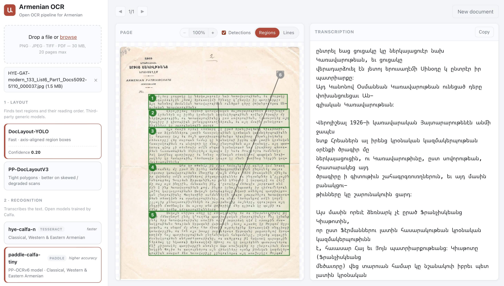

# Armenian OCR

An **open** OCR pipeline for **printed Armenian documents** (Classical, Western
and Eastern), maintained by [Calfa](https://calfa.fr). This open release is
designed for a wide variety of documents. For handwritten and complex documents,
and structure extraction, see [Calfa](https://ocr.calfa.fr). 

It is built from two
complementary stages:

- **Layout detection & reading order** — a third-party, generic document-layout
  detector ([DocLayout-YOLO](https://github.com/opendatalab/DocLayout-YOLO) by
  [opendatalab](https://github.com/opendatalab), or PP-DocLayoutV3) finds text
  regions, which are then ordered with a recursive X-Y-cut reading-order
  heuristic drawn from Portmind's armenian-ocr and updated here by Calfa.
- **Recognition** — open models trained by [Calfa](https://calfa.fr):
  [`hye-calfa-n`](https://github.com/calfa-co/hye-tesseract) (based on
  Tesseract 5, the default and the fastest) and
  [`paddle-calfa-tiny`](https://github.com/calfa-co/hye-paddle) (based on
  PP-OCRv6-tiny, the most accurate but slower), covering Classical, Western and
  Eastern Armenian.

It ships as the **`hyocr` command-line tool** (the main way to use it) plus an
optional web app to illustrate and test it. Outputs:
- **plain text**,
- **searchable PDF**,
- **ALTO XML v4**
- **structured JSON** (paragraphs →
lines → words, with boxes and confidences).

Process doesn't require a GPU and can run on a CPU. Can be slow on large images or with dense contents.

## Architecture

The pipeline is modular: both stages are protocols
(`armenian_ocr/types.py`), so either can be swapped without touching the
rest.

```
image ──► LayoutEngine.analyze(image)            ──► regions (reading order)
      ──► Recognizer.recognize(image, regions)   ──► paragraphs → lines → words
      ──► export: txt / json / alto / pdf
```

| Stage | Options |
|---|---|
| Layout | `yolo` (DocLayout-YOLO, fast) or `paddle` (PP-DocLayoutV3, tight polygons on skewed/degraded scans); reading order `xycut` (default) or `native` (paddle only) |
| Recognition | `tesseract` (`hye-calfa-n`, based on Tesseract 5 — default, fastest) or `paddle` (`paddle-calfa-tiny`, based on PP-OCRv6-tiny — most accurate, slower) |

The layout stage only finds regions; line and word segmentation is left to the
recognizer.

## Models

All models are downloaded on first use and cached locally:

| Model | Default source | Local override |
|---|---|---|
| DocLayout-YOLO | public repo [`juliozhao/DocLayout-YOLO-DocStructBench`](https://huggingface.co/juliozhao/DocLayout-YOLO-DocStructBench) | `ARMENIAN_OCR_YOLO_WEIGHTS` (path to a `.pt` file) |
| PP-DocLayoutV3 | public repo [`PaddlePaddle/PP-DocLayoutV3_safetensors`](https://huggingface.co/PaddlePaddle/PP-DocLayoutV3_safetensors) | `ARMENIAN_OCR_PADDLE_LAYOUT_DIR` (a model directory) |
| `hye-calfa-n` | public repo [`calfa-co/hye-tesseract`](https://github.com/calfa-co/hye-tesseract) | `ARMENIAN_OCR_TESSDATA_DIR` (a tessdata directory) |
| `paddle-calfa-tiny` | public repo [`calfa-co/hye-paddle`](https://github.com/calfa-co/hye-paddle) | `ARMENIAN_OCR_PADDLE_REC_DIR` (an inference directory) |


Both recognition models are also usable **standalone**, outside this pipeline,
directly in their own ecosystem — `hye-calfa-n` as a Tesseract 5 traineddata
file, `paddle-calfa-tiny` as a PaddleOCR recognition model. See their
respective repositories for instructions. In every case the
[license](#license) applies and the credits below are mandatory.

## Installation

Requires Python ≥ 3.10 and the [Tesseract](https://tesseract-ocr.github.io/)
binary (`brew install tesseract` / `apt-get install tesseract-ocr`).

```shell
python3 -m venv ocr
source ocr/bin/activate
git clone https://github.com/calfa-co/hye-open-ocr.git
cd hye-open-ocr

# full install (recommended): Tesseract + Paddle models + web app
pip install ".[paddle,app]"
```

The base install (`pip install .`) covers the default pipeline —
DocLayout-YOLO layout + the `hye-calfa-n` Tesseract recognizer. Add the extras
you need:

- **`paddle`** — required for `--recognizer paddle` (`paddle-calfa-tiny`) and
  `--layout paddle` (PP-DocLayoutV3). Installs `paddleocr` + `paddlepaddle`
  (CPU wheel; GPU users install `paddlepaddle-gpu` instead).
- **`app`** — the optional web app (FastAPI + uvicorn).

## Command-line interface

`hyocr` is the primary way to run the pipeline — ideal for batch processing and
scripting.

```shell
hyocr document.pdf --layout yolo --recognizer paddle -f pdf -o output/
```

Useful options:

- `--layout {yolo,paddle}` — layout detector (required for OCR).
- `--recognizer {tesseract,paddle}` — recognition model (default: `tesseract`).
- `--reading-order {xycut,native}` — reading-order strategy (`native` is
  PP-DocLayoutV3's own order and applies to `--layout paddle` only).
- `-f, --formats txt,json,alto,pdf` — output formats (default: `txt,json`).
- `-o, --output-dir` — output directory (default: current directory).
- `--yolo-conf 0.2` — DocLayout-YOLO confidence threshold. Lower it to recover
  text on hard pages where regions are missed.
- `--region-psm 4` — Tesseract page-segmentation mode for regions.
- `--dpi 300` — PDF rendering resolution and Tesseract DPI hint.
- `--tessdata-dir` / `--yolo-weights` / `--paddle-layout-dir` — use local model
  files (skip the download).

Run `hyocr --help` for the full list. (`armenian-ocr` also works as an alias.)

## Python library

The same pipeline is available as a library:

```python
import numpy as np
from PIL import Image
from armenian_ocr import OcrPipeline
from armenian_ocr.export import export_pages

pipeline = OcrPipeline()  # downloads models on first use
image = np.array(Image.open("page.png").convert("RGB"))
page = pipeline.process_image(image)

print(page.text)  # reading order
export_pages([page], ["txt", "alto", "pdf"], "output/", stem="page",
             images=[image], source_name="page.png")
```

## Web app (optional)

A small web app is included to illustrate and test the pipeline — a convenience,
not the primary interface. The `app/` directory is a FastAPI + vanilla JS
single-page app: drag & drop an image or PDF, choose the layout and recognition
models, per-page progress and text preview, a region/line overlay you can zoom, a
**confidence preview** to see which regions a lower threshold recovers, a
**compare** view for the layout detectors, and the four download formats. It is
also the quickest way to **test layout-detection and reading-order settings** on
your own documents before running a batch through `hyocr`.



Run it locally:

```shell
pip install ".[app]"
uvicorn app.main:app --port 7860   # then open http://localhost:7860
```

## Tests

```shell
pytest                 # unit tests (no models needed)
```

## Credits & links

- **Reading order** — recursive X-Y-cut heuristic drawn from Portmind's
  armenian-ocr and updated here.
- **Layout detection** — [DocLayout-YOLO](https://github.com/opendatalab/DocLayout-YOLO)
  by [opendatalab](https://github.com/opendatalab); PP-DocLayoutV3 by PaddlePaddle.
- **Recognition** — [`hye-calfa-n`](https://github.com/calfa-co/hye-tesseract)
  (Tesseract 5) and [`paddle-calfa-tiny`](https://github.com/calfa-co/hye-paddle)
  (PP-OCRv6-tiny), open models trained by [Calfa](https://calfa.fr).
- **Development & funding** — developed by [Calfa](https://calfa.fr), in
  partnership with the DALiH project (ANR-21-CE38-0006) and with original
  funding from the Calouste Gulbenkian Foundation.
- **This project** — <https://github.com/calfa-co/hye-open-ocr>.
- **Handwritten & complex documents, structure extraction** — Calfa:
  <https://ocr.calfa.fr>.

## License

CC BY-NC 4.0 — see [LICENSE](LICENSE-CC-BY-NC-4.0.md). The recognition models
`hye-calfa-n` and `paddle-calfa-tiny` are © [Calfa](https://calfa.fr); the
license and the credits above apply to any use, including standalone use of a
model in Tesseract or PaddleOCR.
Third-party components keep their own licenses: **PyMuPDF** and
**DocLayout-YOLO** are AGPL-3.0; **PaddleOCR** is Apache-2.0.

## How to cite and some references on Armenian OCR

```bibtex
@article{vidal2026semantic,
  title={Semantic-Guided Reading Order Reconstruction in Historical Armenian Newspapers with LLMs},
  author={Vidal-Gor{\`e}ne, Chahan and Tomeh, Nadi and Khurshudyan, Victoria},
  journal={arXiv preprint arXiv:2607.00596},
  year={2026}
}
```

```bibtex
@unpublished{vidalgorene:hal-05021697,
  TITLE = {{Armenian HTR: State of the art, transcription guidelines and good practices}},
  AUTHOR = {Vidal-Gor{\`e}ne, Chahan and Decours-Perez, Ali{\'e}nor and Kasparian, Anahide and Tanelian, Ani and Ohanian, Agn{\`e}s},
  URL = {https://enc.hal.science/hal-05021697},
  NOTE = {BnF DataLab Projet Fonds Dulaurier},
  YEAR = {2025},
  KEYWORDS = {Handwritten Text Recognition ; Armenian Paleography ; HTR ; Historical Manuscripts ; Armenian ; Paleography ; Guidelines and recommendations},
  PDF = {https://enc.hal.science/hal-05021697v1/file/Armenian_HTR_Guidelines.pdf},
  HAL_ID = {hal-05021697},
  HAL_VERSION = {v1},
}
```

```bibtex
@article{vidal2023ocr,
  title={OCR/HTR technologies and Armenian heritage preservation},
  author={Vidal-Gor{\`e}ne, Chahan},
  journal={Bulletin of Armenian libraries},
  volume={6},
  number={1},
  pages={61--65},
  year={2023}
}
```
